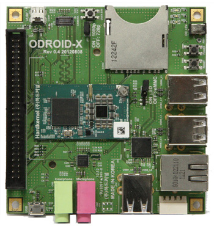

All rights are of their respective owners.
Some sections have been copied for archive purposes.

# ODROID-X




The ODROID-X is a very low cost, high performance development platform based on an Exynos 4412 ARM Cortex-A9 Quad Core 1.4GHz CPU. It has 6 USB 2.0 ports, micro HDMI, The board has several accessories available through Hardkernel such as 10.1" and 14" LVDS LCDs (with adapters), Wifi and Bluetooth adapters, 1.8v serial adapter (recommended if you're going to be any debugging...actually, it's recommended anyway so you won't have to pay shipping twice when you realize you need it later), and an eMMC storage module. They also have a camera module, but currently it does not work with Linux.

Other features of the board include:

*   ARMv7 Cortex-A9 Architecture
*   Samsung Exynos 4412 1.4GHz Processor
*   1GB RAM
*   Mali-400 Quad Core Graphics accelerator
*   1080p/720p video over HDMI, 1360x768 over LVDS
*   3.5mm headphone/microphone jacks
*   6x USB 2.0 Host ports
*   1x USB 2.0 Device port
*   50 pin I/O expansion port for LCD/I2C/UART/SPI/ADC/GPIO interfaces
*   Full size SDHC
*   eMMC module
*   Ethernet 10/100
*   MIPI-CAM camera connector (not yet supported)
*   90 mm x 94 mm base board size

## Odroid Magazine

Available at [Odroid Magazine](http://magazine.odroid.com/)

* [Odroid Magazine 01/2014](https://magazine.odroid.com/issue/201401/)
* [Odroid Magazine 02/2014](https://magazine.odroid.com/issue/201402/)
* [Odroid Magazine 03/2014](https://magazine.odroid.com/issue/201403/)
* [Odroid Magazine 04/2014](https://magazine.odroid.com/issue/201404/)
* [Odroid Magazine 05/2014](https://magazine.odroid.com/issue/201405/)
* [Odroid Magazine 06/2014](https://magazine.odroid.com/issue/201406/)
* [Odroid Magazine 07/2014](https://magazine.odroid.com/issue/201407/)
* [Odroid Magazine 08/2014](https://magazine.odroid.com/issue/201408/)
* [Odroid Magazine 09/2014](https://magazine.odroid.com/issue/201409/)
* [Odroid Magazine 10/2014](https://magazine.odroid.com/issue/201410/)
* [Odroid Magazine 11/2014](https://magazine.odroid.com/issue/201411/)
* [Odroid Magazine 12/2014](https://magazine.odroid.com/issue/201412/)
* [Odroid Magazine 01/2015](https://magazine.odroid.com/issue/201501/)
* [Odroid Magazine 02/2015](https://magazine.odroid.com/issue/201502/)
* [Odroid Magazine 03/2015](https://magazine.odroid.com/issue/201503/)
* [Odroid Magazine 04/2015](https://magazine.odroid.com/issue/201504/)
* [Odroid Magazine 05/2015](https://magazine.odroid.com/issue/201505/)
* [Odroid Magazine 06/2015](https://magazine.odroid.com/issue/201506/)
* [Odroid Magazine 07/2015](https://magazine.odroid.com/issue/201507/)
* [Odroid Magazine 08/2015](https://magazine.odroid.com/issue/201508/)
* [Odroid Magazine 09/2015](https://magazine.odroid.com/issue/201509/)
* [Odroid Magazine 10/2015](https://magazine.odroid.com/issue/201510/)
* [Odroid Magazine 11/2015](https://magazine.odroid.com/issue/201511/)
* [Odroid Magazine 12/2015](https://magazine.odroid.com/issue/201512/)
* [Odroid Magazine 01/2016](https://magazine.odroid.com/issue/201601/)
* [Odroid Magazine 02/2016](https://magazine.odroid.com/issue/201602/)
* [Odroid Magazine 03/2016](https://magazine.odroid.com/issue/201603/)
* [Odroid Magazine 04/2016](https://magazine.odroid.com/issue/201604/)
* [Odroid Magazine 05/2016](https://magazine.odroid.com/issue/201605/)
* [Odroid Magazine 06/2016](https://magazine.odroid.com/issue/201606/)
* [Odroid Magazine 07/2016](https://magazine.odroid.com/issue/201607/)
* [Odroid Magazine 08/2016](https://magazine.odroid.com/issue/201608/)
* [Odroid Magazine 09/2016](https://magazine.odroid.com/issue/201609/)
* [Odroid Magazine 10/2016](https://magazine.odroid.com/issue/201610/)
* [Odroid Magazine 11/2016](https://magazine.odroid.com/issue/201611/)
* [Odroid Magazine 12/2016](https://magazine.odroid.com/issue/201612/)
* [Odroid Magazine 01/2017](https://magazine.odroid.com/issue/201701/)
* [Odroid Magazine 02/2017](https://magazine.odroid.com/issue/201702/)
* [Odroid Magazine 03/2017](https://magazine.odroid.com/issue/201703/)
* [Odroid Magazine 04/2017](https://magazine.odroid.com/issue/201704/)
* [Odroid Magazine 05/2017](https://magazine.odroid.com/issue/201705/)
* [Odroid Magazine 06/2017](https://magazine.odroid.com/issue/201706/)
* [Odroid Magazine 07/2017](https://magazine.odroid.com/issue/201707/)
* [Odroid Magazine 08/2017](https://magazine.odroid.com/issue/201708/)
* [Odroid Magazine 09/2017](https://magazine.odroid.com/issue/201709/)
* [Odroid Magazine 10/2017](https://magazine.odroid.com/issue/201710/)
* [Odroid Magazine 11/2017](https://magazine.odroid.com/issue/201711/)
* [Odroid Magazine 12/2017](https://magazine.odroid.com/issue/201712/)
* [Odroid Magazine 01/2018](https://magazine.odroid.com/issue/201801/)
* [Odroid Magazine 02/2018](https://magazine.odroid.com/issue/201802/)
* [Odroid Magazine 03/2018](https://magazine.odroid.com/issue/201803/)
* [Odroid Magazine 04/2018](https://magazine.odroid.com/issue/201804/)


## Links

* [Hardkernel](http://www.hardkernel.com)
* [Odroid Forum](http://forum.odroid.com/viewforum.php?f=130)
* [Odroid Reddit](https://www.reddit.com/r/ODroid/)
* [Hardkernel downloads](http://com.odroid.com/sigong/nf_file_board/nfile_board.php?tag=ODROID-X)
* [Odroid project hosting](http://oph.mdrjr.net/meveric/)
* [How to install Ubuntu in EMMC](http://com.odroid.com/sigong/prev_forum/t2440-guide-installing-the-latest-ubuntu-on-odroid-x-emmc.html)
* [U-Boot and hw](https://wiki.odroid.com/old_product/odroid-x_u_q/odroid-xq)
* [Useful links for Linux Arch on ARM](https://github.com/phortx/Raspberry-Pi-Setup-Guide)
* [Linux-Exynos 4412](http://linux-exynos.org/wiki/Samsung_Exynos_4412)
* [Linux-Samsung-SOC Patchwork](https://patchwork.kernel.org/project/linux-samsung-soc/)

## Images and Distributions

* [Arch Linux](http://nl2.mirror.archlinuxarm.org/os/)
* [Ubuntu 16.04 LTS](http://odroid.in/ubuntu_16.04lts/)
* [Odroid game station with XMBC](http://forum.odroid.com/viewtopic.php?f=11&t=2684)

## Arch Linux

The following text has been replicated from [Arch Linux documentation](https://archlinuxarm.org/platforms/armv7/samsung/odroid-x)

The board [PKGBUILD](https://github.com/archlinuxarm/PKGBUILDs/blob/master/core/linux-odroid/PKGBUILD).

### SD Card Creation

Replace **sdX** in the following instructions with the device name for the SD card as it appears on your computer.

1.  Zero the beginning of the SD card:

    <pre>dd if=/dev/zero of=/dev/sdX bs=1M count=8</pre>

2.  Start fdisk to partition the SD card:

    <pre>fdisk /dev/sdX</pre>

3.  At the fdisk prompt, create the new partitions:
    1.  Type **o**. This will clear out any partitions on the drive.
    2.  Type **p** to list partitions. There should be no partitions left.
    3.  Type **n**, then **p** for primary, **1** for the first partition on the drive, and **enter** twice to accept the default starting and ending sectors.
    4.  Write the partition table and exit by typing **w**.
4.  Create the ext4 filesystem:

    <pre>mkfs.ext4 /dev/sdX1</pre>

5.  Mount the filesystem:

    <pre>mkdir root
    mount /dev/sdX1 root</pre>

6.  Download and extract the root filesystem (as root, not via sudo):

    <pre>wget http://os.archlinuxarm.org/os/ArchLinuxARM-odroid-x-latest.tar.gz
    bsdtar -xpf ArchLinuxARM-odroid-x-latest.tar.gz -C root</pre>

7.  Flash the bootloader files:

    <pre>cd root/boot
    ./sd_fusing.sh /dev/sdX
    cd ../..</pre>

8.  Unmount the partition:

    <pre>umount root</pre>

9.  Set the boot switches on the ODROID-X board to boot from SD:
    1.  Locate the jumper between the SD slot, USB ports, and heatsink, labeled for eMMC and SD selection
    2.  Place the jumper over just one of the pins (so you don't lose it), not over both pins.
10.  Insert the SD card into the board, connect ethernet, and apply 5V power.
11.  Use the serial console (with a null-modem adapter if needed) or SSH to the IP address given to the board by your router.
    *   Login as the default user _alarm_ with the password _alarm_.
    *   The default root password is _root_.

### eMMC Module Creation

In case you do not have the emmc to SD adapter, just repeat the procedure above when running from SD.

Pay attention to target the /dev/mmcblkX and /dev/mmcblkXp1, where X doesn't correspond to what is shown in 

```
df -h
# or
mount -l | grep -i mmc
```

4.  Power off the board: _poweroff_
5.  Remove the micro SD adapter, detach the eMMC module, and connect the eMMC module to its connector on the board.
6.  Set the boot switches on the ODROID-X to boot from eMMC:
    1.  Locate the jumper between the SD slot, USB ports, and heatsink, labeled for eMMC and SD selection
    2.  Place the jumper over both pins.
7.  Re-apply power the board.
8.  Use the serial console (with a null-modem adapter if needed) or SSH to the IP address given to the board by your router.
    *   Login as the default user _alarm_ with the password _alarm_.
    *   The default root password is _root_.

### Notes

*   The kernel will always recognize the SD card first if it is connected. The jumper selection only controls what appears first for U-Boot, and which device will be looked at for finding the bootloader.
*   To use the SD as additional storage while booting from eMMC:
    1.  Boot with only the eMMC module as described above.
    2.  Open _/boot/uEnv.txt_ in your favorite editor.
    3.  Uncomment the _mmcroot_ line, change _/dev/mmcblk0p1_ to _/dev/mmcblk1p1_, and save the file.
    4.  Power off the board, connect the SD card, and boot the board again. The SD card will be available under _/dev/mmcblk0_ now.

## How-To Section

### Update system packages

```
pacman -Syuw
pacman -Su
pacman-key --init
pacman-key --populate archlinuxarm
sed -i 's/#Color/Color/' /etc/pacman.conf # to addd color to pacman
```

### Enable NTPD as no RTC is present
```
timedatectl set-local-rtc 0
nano /etc/timezone # set Europe/Paris
```

### Setup WiFi
```
pacman -Sy netctl wpa_actiond dialog crda
iw reg set FR
iw reg get
# edit the /etc/conf.d/wireless-regdom
# add "Country=<code>" in the netctl profile
wifi-menu
systemctl enable netctl-auto@wlan0-<ssid>
iwconfig wlan0 power off # in case random disconnections occur
```

### How to install docker

Follow the guide on how to install docker on [ARMv7](https://github.com/umiddelb/armhf/wiki/Installing,-running,-using-docker-on-armhf-(ARMv7)-devices)
* Run ```pacman -S docker```
* Run ```zcat /proc/config.gz > /tmp/.config```
* Verify ```curl -L https://raw.githubusercontent.com/docker/docker/master/contrib/check-config.sh | /bin/bash /dev/stdin /tmp/.config``` and ensure all mandatory prerequisites are present

An alternative procedure is detailed [here](https://gist.github.com/bullshit/10502689).

### GPIO Pinout

If the kernel support for GPIO is enabled, you should have ```/sys/class/gpio/```.
To print the labels of each endpoint run ```for file in gpio*; do echo -n "$file - ";cat $file/label; done```.

```
root@alarm gpio]# for file in gpio*; do echo -n "$file - ";cat $file/label; done
gpiochip0 - gpa0
gpiochip104 - gpk3
gpiochip111 - gpl0
gpiochip118 - gpl1
gpiochip120 - gpl2
gpiochip128 - gpm0
gpiochip136 - gpm1
gpiochip14 - gpb
gpiochip143 - gpm2
gpiochip148 - gpm3
gpiochip156 - gpm4
gpiochip164 - gpy0
gpiochip170 - gpy1
gpiochip174 - gpy2
gpiochip180 - gpy3
gpiochip188 - gpy4
gpiochip196 - gpy5
gpiochip204 - gpy6
gpiochip212 - gpx0
gpiochip22 - gpc0
gpiochip220 - gpx1
gpiochip228 - gpx2
gpiochip236 - gpx3
gpiochip244 - gpz
gpiochip251 - gpv0
gpiochip259 - gpv1
gpiochip267 - gpv2
gpiochip27 - gpc1
gpiochip275 - gpv3
gpiochip283 - gpv4
gpiochip32 - gpd0
gpiochip36 - gpd1
gpiochip40 - gpf0
gpiochip48 - gpf1
gpiochip56 - gpf2
gpiochip64 - gpf3
gpiochip70 - gpj0
gpiochip78 - gpj1
gpiochip8 - gpa1
gpiochip83 - gpk0
gpiochip90 - gpk1
gpiochip97 - gpk2
```

```
Pinout from schematics
GND          50 49    ADC_AIN3
VDD_IO       48 47    ADC_AIN2
SYS          46 45    VD16
VD13         44 43    VD22
VD4          42 41    VD1
VD23         40 39    VD9
VD17         38 37    VD14
VD10         36 35    VD5
VD12         34 33    VD3
GND          32 31    HSYNC
VD20         30 29    VDEN
VD6          28 27    VSYNC
VD11         26 25    VD18
VD7          24 23    VCLK
VD0          22 21    VD15
VD8          20 19    VD2
VD21         18 17    VD19
TXD          16 15    SPI_1_MISO
RXD          14 13    PWM_BRT
VDDQ_LCD     12 11    SPI_1_MOSI
SPI_1_CSN    10 09    XE_INT12
T_SDA        08 07    T_SCL
SPI_1_CLK    06 05    SCL
T_RST        04 03    SDA
BL_EN        02 01    T_INT
```

The table below is for Odroid X2 from [this page](http://odroid.com/dokuwiki/doku.php?id=en:odroid-xq#expansion_header_details_of_base_board).

| PIN# | Expansion net name for ODROID-X | Pin name of Exynos4412 | Function | Description |
|------|---------------------------------|------------------------|----------|-------------|
| 1 | T_INT | XEINT[27] | GPX3[3]/WAKEUP_INT3[3]/KP _ROW[11]/ALV_DBG[23] | |
| 2 | BL_EN | UXuRTSn[2] | GPA1[3]/UART_2_RTSn/I2C_3_SCL |  |
| 3 | SDA | Xi2c1SDA | GPD1[2]/I2C_1_SDA |  |
| 4 | T_RST | XEINT[17] | GPX2[1]/WAKEUP_INT2[1]/KP _ROW[1]/ALV_DBG[13] |  |
| 5 | SCL | IXi2c1SCL | GPD1[3]/I2C_1_SCL |  |
| 6 | SPI_1.CLK | XspiCLK[1] | GPB[4]/SPI_1_CLK/IEM_SCLK |  |
| 7 | T_SCL | XspiMOSI[0] | GPB[3]/SPI_0_MOSI/I2C_5_SCL |  |
| 8 | T_SDA | XspiMISO[0] | GPB[2]/SPI_0_MISO/I2C_5_SDA |  |
| 9 | XE.INT12 | XEINT[12] | GPX1[4]/WAKEUP_INT1[4]/KP _COL[4]/ALV_DBG[8] |  |
| 10 | SPI_1.CSN | XspiCSn[1] | GPB[5]/SPI_1_nSS/IEM_SPWI |  |
| 11 | SPI_1.MOSI | XspiMOSI[1] | GPB[7]/SPI_1_MOSI |  |
| 12 | VDDQ_LCD |  |  | LDO25 of MAX77686 |
| 13 | PWM_BRT | XpwmTOUT[1] | GPD0[1]/TOUT_1/LCD_PWM |  |
| 14 | RXD | XuRXD[3] | GPA1[4]/UART_3_RXD/UART_AUDIO _RXD |  |
| 15 | SPI_1.MISO | XspiMISO[1] | GPB[6]/SPI_1_MISO |  |
| 16 | TXD | XuTXD[3] | GPA1[1]/UART_3_TXD/UART_AUDIO _TXD |  |
| 17 | VD19 | XvVD[19] | GPF2[7]/LCD_VD[19] |  |
| 18 | VD21 | XvVD[21] | GPF3[1]/LCD_VD[21] |  |
| 19 | VD2 | XvVD[2] | GPF0[6]/LCD_VD[2] |  |
| 20 | VD8 | XvVD[8] | GPF1[4]/LCD_VD[8] |  |
| 21 | VD15 | XvVD[15] | GPF2[3]/LCD_VD[15] | | 
| 22 | VD0 | XvVD[0] | GPF0[4]/LCD_VD[0] |  |
| 23 | VCLK | XvVCLK | GPF0[3]/LCD_VCLK |  |
| 24 | VD7 | XvVD[7] | GPF1[3]/LCD_VD[7] |  |
| 25 | VD18 | XvVD[18] | GPF2[6]/LCD_VD[18] | | 
| 26 | VD11 | XvVD[11] | GPF1[7]/LCD_VD[11] |  |
| 27 | VSYNC | XvVSYNC | GPF0[1]/LCD_VSYNC |  |
| 28 | VD6 | XvVD[6] | GPF1[2]/LCD_VD[6] |  |
| 29 | VDEN | XvVDEN | GPF0[2]/LCD_VDEN |  |
| 30 | VD20 | XvVD[20] | GPF3[0]/LCD_VD[20]  || 
| 31 | HSYNC | XvHSYNC | GPF0[0]/LCD_HSYNC |  |
| 32 | GND | Ground |  |  |
| 33 | VD3 | XvVD[3] | GPF0[7]/LCD_VD[3] |  |
| 34 | VD12 | XvVD[12] | GPF2[0]/LCD_VD[12] | | 
| 35 | VD5 | XvVD[5] | GPF1[1]/LCD_VD[5] |  |
| 36 | VD10 | XvVD[10] | GPF1[6]/LCD_VD[10] | | 
| 37 | VD14 | XvVD[14] | GPF2[2]/LCD_VD[14] |  |
| 38 | VD17 | XvVD[17] | GPF2[5]/LCD_VD[17] |  |
| 39 | VD9 | XvVD[9] | GPF1[5]/LCD_VD[9] |  |
| 40 | VD23 | XvVD[23] | GPF3[3]/LCD_VD[23] | 
| 41 | VD1 | XvVD[1] | GPF0[5]/LCD_VD[1] |  |
| 42 | VD4 | XvVD[4] | GPF1[0]/LCD_VD[4] |  |
| 43 | VD22 | XvVD[22] | GPF3[2]/LCD_VD[22] | | 
| 44 | VD13 | XvVD[13] | GPF2[1]/LCD_VD[13] |  |
| 45 | VD16 | XvVD[16] | GPF2[4]/LCD_VD[16] |  |
| 46 | SYS | DC Jack +5V |  |  |
| 47 | ADC.AIN2 | XadcAIN[2] | XadcAIN[2] |  |
| 48 | VDD_IO |  |  | LDO3 of MAX77686 |
| 49 | ADC.AIN3 | XadcAIN[3] | XadcAIN[3] |  |
| 50 | GND | Ground |  |  |

### Run portainer

```
$ docker volume create portainer_data
$ docker run --restart unless-stopped -d -p 9000:9000 -v /var/run/docker.sock:/var/run/docker.sock -v portainer_data:/data portainer/portainer:arm
```

### Run MotionEye in Docker

Follow the [guide](https://github.com/ccrisan/motioneye/wiki/Install-in-Docker):

```
cd
pacman -S git
```

Edit the ```extra/Dockerfile``` to use the following base image ```armv7/armhf-ubuntu:15.04```

```
git clone https://github.com/ccrisan/motioneye.git
cd motioneye && docker build -f extra/Dockerfile -t motioneye .
```

Wait a little...

To identify the USB webcams and their respective device under /dev/video

```
pacman -S v4l-utils
v4l2-ctl --list-devices
```

Run a docker instance with 2 webcams...

```
docker rm -f motioneye ; docker run -it --name=motioneye \
        --device=/dev/video8:/dev/video0 \
		--device=/dev/video9:/dev/video1 \
        -p 8081:8081 \
        -p 8765:8765 \
        -e TIMEZONE="Europe/Paris" \
        -v /mnt/motioneye/media:/media \
        -v /mnt/motioneye/config:/etc/motioneye \
        -v $PWD:/usr/local/src/motioneye \
        --restart=always \
        motioneye
```

Lower the resolution if you face errors such as ```WARNING: Connect error on fd 21: ECONNREFUSED```.
You can troubleshoot checking with ```docker exec -it <docker instance id> dmesg```
If you get ```uvcvideo: Failed to submit URB 0 (-28)```, it's probably a bandwidth issue.
